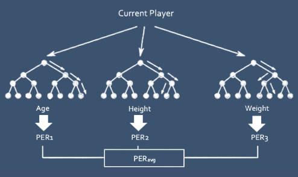
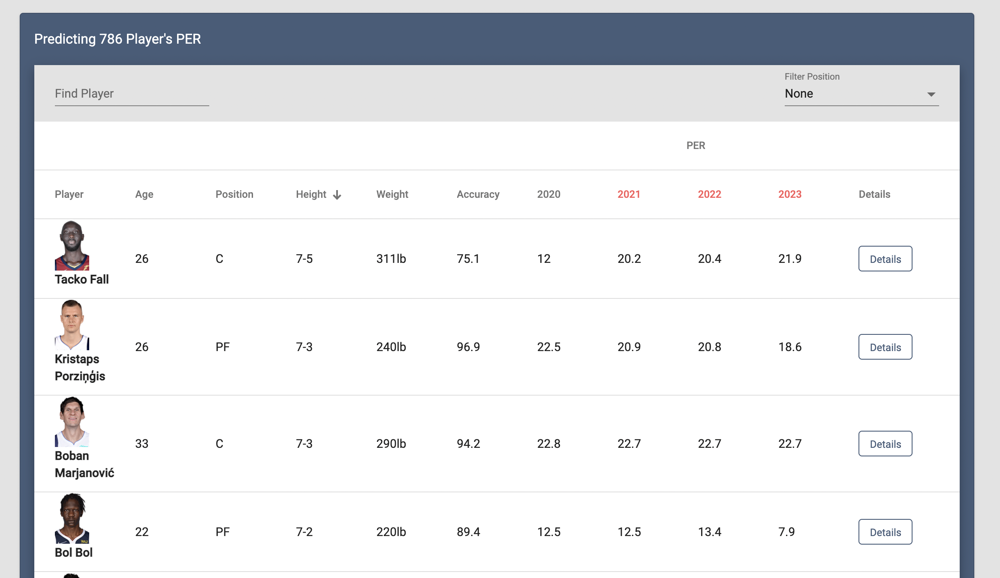
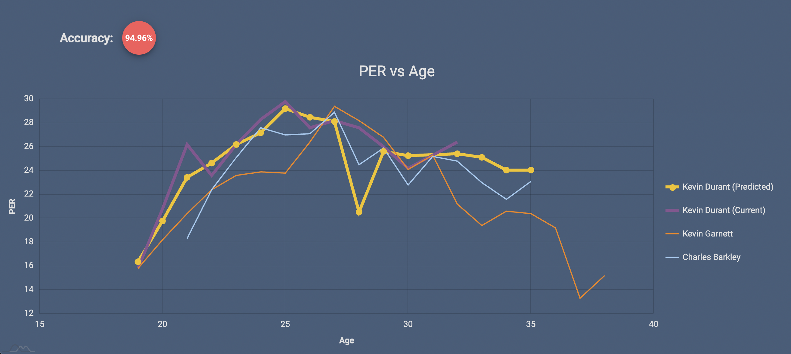

<p align="center">

</p>

<p align="center">
  <a href="#-basic-overview">Basic Overview</a> •
  <a href="#-app-screenshots">App Screenshots</a> •
  <a href="#-data-processing-execution-instructions">Data Processing Execution</a> •
  <a href="#-visualizing-results">Visualizing Results</a>

</p>  

## 📌 Basic Overview 

Using historical basketball data, train a supervised learning algorithm with any combination of features including age, height, and weight to predict a player's Player Efficiency Rating (PER) for the next three years. The model chosen is a random forest regressor which makes use of bagging decision trees and splitting each branch on a feature. Finally, an average prectided PER will be calculated for current NBA players.
<p align="center"></p>


## 📷 App Screenshots

<p align="center">

</p>                                                                                                          
<p align="center">

</p>   

## 📋 Data Processing Execution Instructions

<p>The order of execution of the program files is as follows:</p>
<p><b>1) Schema.sql</b> <i>(Database setup)</i></p>
<p>First, the Schema.sql file must be executed to setup the MySQL database.</p>
<p><b>2) WebScraper.py</b> <i>(Data collection)</i></p>
<p>Next, the WebScraper.py file must be executed to scrape over 1600 NBA players stats and images in less than 5 minutes. Current NBA player data is collected as well as two similar historical NBA players for each player. Similar players are obtained by calulcating similarity scores (https://www.basketball-reference.com/about/similar.html). </p>
<p><b>3) Prediction.py</b> <i>(Data preparation, input, processing, output, storage)</i></p>
<p>Then, the Prediction.py file must be executed, which leads to the production of the model and prediction of PER.</p>
<p><b>4) PlayerPosition.sql</b></p>
<p>Finally, the schema is modified to allow for proper filtering queries by executing PlayerPosition.sql.</p>


## 🔍 Visualizing Results

```shell
# Step 1: Run Node app
$ cd NodeJS
$ npm install
$ node index.js
```
```shell
# Step 2: Install Angular client and run app
$ npm install -g @angular/cli@9.1.1
$ cd nba-per-prediction
$ npm install
$ ng serve
```
<p>Navigate to http://localhost:4200/. An average accuracy of about 84% was achieved by predicting PER with this model.</p>
